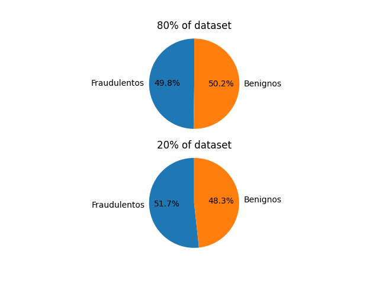

# Projeto de Ciência de Dados em Segurança

## Alunos
- Daniel Neves: GRR20171603
- João Vitor Moreira: GRR20171621

## Relatório
[Link do relatório](./Relatorio.pdf)

## Execução
OBS: Todos os scripts são executados com `python3 <script.py> `

Os arquivos base de datasets já estão todos criados, então basta escolher um dos arquivos de classificador (knn, knn-kfold, rf, rf-kfold, mlp ou mlp-kfold) e executá-lo para que o script treine e teste o modelo, primeiramente com os 80% (tanto com percentage_split quanto com k-fold) e depois com os 20%.
## Scripts de criação de datasets
OBS: Todos os scripts são executados com `python3 <script.py> `
- `process_enron.py`: Script de pré-processamento do dataset de emails da Enron (gera o arquivo benign_emails.ts no diretório dataset/raw a partir do dataset extraído do arquivo encontrado [aqui](https://www.cs.cmu.edu/~enron/))
- `percentage_split.py`: Cria as porções 80% e 20% do dataset no diretório dataset/percentage_split a partir dos arquivos fraudulent_emails.txt e benign_emails.txt
- `kfold.py`: divide os 80% do dataset 

## Tipos de Dados

Registros de emails considerados como "phishing" e registros de email benignos, com propriedades majoritariamente textuais, mas também contendo combinações de letras e números (como por exemplo, endereços de email e versões de provedores de email).

## Objetivo

Extrair as principais características deste tipo de email de forma a encontrar correlações e padrões, facilitando a classificação de emails como "phishing" com base em atributos como o endereço do remetente, palavras recorrentes no assunto, horário de envio, provedor de email utilizado para o envio, entre outros dados definidos na seção "Colunas e atributos selecionados".

## Rotulação

Por ser um dataset exclusivamente composto por emails fraudulentos, o único rótulo de classificação dos emails em si é "phishing", pois não há emails benignos.

Os dados de cada email são rotulados no formato "rótulo: valor" (como por exemplo, "Subject: INHERITANCE CLAIM"), exceto pelo conteúdo do email, que vem logo em seguida à propriedade "Status", separado por pelo menos uma linha vazia.

## Distribuição de dados



## Colunas e atributos selecionados

As principais colunas que desejamos manter são:
- Subject: Assunto do email, com o objetivo de encontrar palavras usadas com mais frequência
- Content-Type: Tipo e codificação do conteúdo do email, com o objetivo verificar se algum destes é "preferido" para phishing
- Conteúdo do email: Com o objetivo de verificar a existência de padrões ou recorrência de palavras

As demais colunas foram consideradas menos importantes para a análise dos dados, pois contém majoritariamente meta-dados do email ou informações do destinatário, que não são tão úteis para identificar um email como phishing.

## Fonte do Dataset
```
Radev, D. (2008), CLAIR collection of fraud email, ACL Data and Code Repository, ADCR2008T001, http://aclweb.org/aclwiki
```
link fraudulentos: https://www.kaggle.com/rtatman/fraudulent-email-corpus
```
Cohen W. W. (2015), Enron Email Dataset, https://www.cs.cmu.edu/~./enron/
```
link benignos: https://www.cs.cmu.edu/~enron/